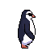
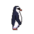
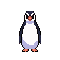

# Production-Ready 2D Sprite Animation Loop

## 🎬 Asset Previews

**Final Production Asset:**

*`runningLoop_final.gif` - The final, color-corrected 8-frame seamless loop.*

**Iterative Development Files:**
*  `runningLoop_firstTry.gif` - Initial animation generation showing palette drift on the left foot.
*  `4direction_firstTry.gif` - Base character generation showing a directional failure (North frame duplicated the South face).
*  `4direction_final.gif` - Base character generation with manually corrected North (back-facing) frame.

## 📝 Project Overview
This repository contains a functional, production-ready 2D animation asset created to fulfill the assignment requirements for a looping sprite-style animation. The objective was to move beyond single-frame "AI art" and prioritize downstream game-engine readability and frame-to-frame coherence over cinematic spectacle. 

The final deliverable successfully provides a seamless 8-frame animation cycle delivered as a stable GIF.

## 🛠️ The Generation Log

### Phase 1: Base Character Generation
* **Tool Used:** PixelLab
* **Base Prompt:** `Pixel art, 16-bit style, cute chubby penguin character wearing cool black sunglasses, strict side profile view, neutral solid magenta background, flat lighting, clean silhouette, no gradients, no shadows, sharp pixels.`
* **Settings Used to Lock Identity:**
  * **Size:** 48px 
  * **Camera View:** Sidescroller (demands a locked camera and fixed silhouette across frames).
  * **Style:** Single color black outline, Basic shading (ensures consistent lighting and prevents pixel-boil).
  * **Padding:** Horizontal 50%, Vertical 30% (prevents clipping during the animation bounce).

### Phase 2: Animation Generation
* **Tool Used:** PixelLab (Custom Animation V3)
* **Action Prompt:** `fast running cycle, energetic waddling, side profile view, seamless animation loop, strict 2D platformer movement, arms back`
* **Settings:** 8 Frames (meeting the minimum frame requirement). "Keep first frame (idle pose)" was strictly disabled to ensure that the last frame flows smoothly into the first frame for a clean loop seam.

### Phase 3: Iterative Steps & Manual Correction
To strip away "AI shimmer" and fix pipeline failures, an iterative approach with manual pixel correction was required:
1. **Directional Logic Failure (`4direction_firstTry.gif`):** The initial 4-direction base generation failed to properly render the North (back-facing) frame, hallucinating and duplicating the South (front-facing) sprite instead. This was manually corrected (`4direction_final.gif`) to establish a true, usable 4-way template before proceeding to animation.
2. **Palette Drift (`runningLoop_firstTry.gif`):** During the V3 animation generation, the model suffered minor palette drift, rendering the character's left foot black in the final frames instead of orange. The foot was manually recolored to match the exact base orange palette across all 8 frames (`runningLoop_final.gif`) to eliminate identity drift.

## 🛡️ Animation Consistency Triad Audit

This asset has been self-evaluated against the Animation Consistency Triad:

1. **Identity Consistency:** 
   *Does the character read as the same character across every frame?* Yes. By establishing a rigid base character using a 'Sidescroller' camera and basic shading, the core silhouette and accessories (sunglasses) are locked. Following the manual color correction pass on the foot, the character maintains strict identity without outfit morphing or facial drift.
   
2. **Temporal Consistency:** 
   *Is motion smooth, with stable volumes and no popping textures or limb-swaps between frames?* Yes. Complex gradients were explicitly removed from the prompts to prevent frame jitter and texture noise. Disabling the idle first frame ensured the motion arc is continuous, allowing the 8th frame to flow seamlessly back into the 1st frame.
   
3. **Pipeline Consistency:** 
   *Are frame size, anchor point, background, and frame timing uniform enough to drop into a game engine or compositing timeline without per-frame cleanup?* Yes. The uniform dimensions and intentional 30% vertical padding prevent background bleed and clipping. The generated GIF plays at a stable frame rate, proving the asset is ready for downstream integration.
